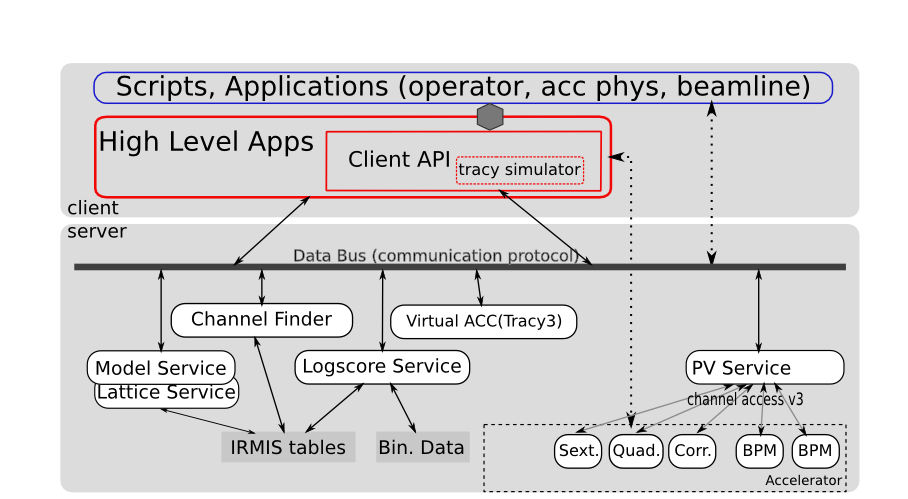

NSLS2 Commissioning Requirement
===============================================================

.. role:: hlawarn
.. role:: hla
.. role:: hladone
.. role:: hladetails

.. _Software Requirement:

This chapter describes software requirement for NSLS-II
commissioning. This list is mainly from [Willeke2009]_ and [Krinsky2010]_ (See `References`_)

Overview of HLA for NSLS-II
------------------------------

``aphla`` is a set of scripts and GUI applications developed in Python_ in
NSLS-II project. A set of existing tools such as MATLAB Middle Layer Toolkit
(MMLT) [MMLT]_ will also be installed in the control room. However, more new
tools need to be developed especially for the first turn beam monitoring and
manipulations.

The new developement will be based on Python_ language, integrated with
libraries for numerical analysis, data input/output, image processing,
network, visualization, statistics and EPICS_ channel access. The package will
be available in standardard Python interactive envirionment, IPython_ notebook
and GUI applications. ``aphla`` can make the beam manipulation and hardware
control more friendly to physicists and operators.

This work is a result of controls group, diagnostics group and accelerator
physics group.

.. 

..
   Schedule for Beam Commissioning
   ~~~~~~~~~~~~~~~~~~~~~~~~~~~~~~~~~

   - 12/01/2011--02/29/2012, LINAC front end commissioning
   - 03/30/2012--07/28/2012, LINAC commissioning
   - 05/29/2012--06/28/2012, LBTL in LINAC commissioning
   - 07/28/2012--08/27/2012, LBTL commissioning
   - 08/27/2012--12/25/2012, Booster commissioning
   - 12/15/2012--01/14/2013, BSTL in booster tunnel
   - 01/14/2013--01/24/2013, BSTL
   - 01/24/2013--09/21/2013, Storage Ring Commissioning Part 1
   - 09/21/2013--11/20/2013, ID installation
   - 11/20/2013--02/18/2014, Storage Ring Commissioning Part 2

NSLS2 Beam Commissioning Plan and Tools
----------------------------------------

Without Beam
~~~~~~~~~~~~

    - Measure magnets to determine field quality
    - Determine calibration
    - Develop lattice model using measured fields.

       - Linear optics
       - Nonlinear optics

    - Inspect radiation shielding
    - Test personnel protection system
    - Test loss control monitoring system
    - Prepare, review, sign safety documentation
    - :hla:`Complete staff training`
    - :hla:`Verify that named devices in control system control proper hardware`
    - Check polarity of all magnets
    - :hlawarn:`Complete survey of magnetic elements`
    - Test diagnostic equipment without beam

Phase 1 - without ID
~~~~~~~~~~~~~~~~~~~~~

    - Commission BTS transport line
        - obtain good transmission ghrough septum
        - good transverse phase space match
        - set timing of pulsed magnets

    - Obtain first turn in storage ring using single/multiple kicker
        - :hla:`center beam in single downstream kicker`
        - :hla:`adjust kicker strength to place beam on design orbit`
        - :hla:`use single turn bpms to steer beam trajectory around ring and estimate linear optics and tune`
        - :hla:`use flag to obtain beam size information at injection point and after one turn`

    - look for magnet errors that may have been missed in testing.
    - achieve additional turns around ring
    - achieve circulating beam (hundreds of turns)
    - measure and improve orbit and tune
    - achieve RF capture (lifetime seconds to minutes)
    - measure and improve orbit and tune
    - obtain circulating beam using four kicker magnets to make local injection bump
    - achieve 1Hz accumulation of injected bunches into ring
    - commission loss control monitoring system
        - Monitor beam loss. :hladetails:`Get loss monitor readings from beam containment
          system (beam loss monitor)`.
    - use visible synchrotron light monitor to study transverse beam profile and disturbance due to kickers.
    - improve injection efficiency and RF capture
    - reduce beam loss due to kicker excitation
    - improve orbit and tune
    - improve lifetime
    - use pinhole camera to determine transverse profile energy spread.
        - beam emittance measurement.(subsystem)

    - measure orbit response matrix
    - use LOCO to characterize linear optics.
    - condition vacuum chamber with beam
    - achieve 25mA stored beam
    - study lifetime & vacuum pressure vs. amp-hrs
    - correct coupling using skew quadrupoles.
    - Measure dependence of lifetime on vertical beam size
    - using pinhole camera—estimate Touschek lifetime
    - Measure dependence of lifetime on position of beam scrapers to get information on physical and dynamic aperture
    - Refine LOCO characterization of linear optics
    - Carry out beam based alignment of BPMs
    - Test fast orbit feedback system
    - Characterize nonlinear optics
        - Determine nonlinear dispersion and chromaticity
        - Use Pinger to measure tune shift with amplitude, dynamic aperture and characterize sextupole distribution

    - Increase current
        - Study instability thresholds
        - Commission transverse bunch-by-bunch feedback
        - Measure variation of coherent tune with current
        - Characterize ring impedance using beam
        - Study increasing chromaticity from +2/+2 to +5/+5

    - Compare optics and wakefield models with measurements
        - Wakefield modeling and tracking studies, develop model for impedance
          and wakefields, caculation and measurement, estimate instability
          thresholds, simulate bunch-by-bunch feedback with realistic bunches
          and wakefields. (unknown to HLA yet)

Phase 2 - with IDs
~~~~~~~~~~~~~~~~~~

    - insertion device commissioning
        - Bake beamline equipment
        - Survey front end fiducial marks on the ID beamline
        - Commission undulator gap control in control room
        - Establish and save reference orbit (low current ~5mA)
        - ID front end radiation survey at low current (gap open)
        - ID front end radiation survey opening mask and valve
        - ID front end radiation survey increasing current (gap open)
        - ID front end radiation survey at intervals during vacuum conditioning of safety shutter
        - Establish ID elevation

    - Calibration/testing of  Equipment Protection Interlock System
        - Center photon beam in exit slot
        - Verify gap open/close status is properly reported to interlock system
        - Measure interlock BPM offset and scale factors
        - Adjust the hardware trip points on the local logic chassis
        - Verify beam is dumped at the specified position offsets
        - Set the values in the interlock test file
        - :hlawarn:`Set the values in the micro`
        - Verify the proper operation of the interlock test
        - ID front end radiation survey with gap closed (low current ~5mA)
        - When necessary, compensate linear optics for ID (orbit/tune correction, feedforward table, coupling)
        - Radiation survey with closed gap at progressively higher current—check for component heating
        - Observe orbit and tune shift vs gap
        - Measure lifetime vs gap
        - Observe beam stability vs current
        - Measure change in impedance due to ID chamber
        - Prepare look-up tables for feed forward orbit correction coils
        - Measure effect on tune shift with amplitude, chromaticity and emittance coupling
        - Measure impedance vs gap for IVUs
        - Commission undulator gap control for users
        - Measure undulator spectra vs gap
        - Measure flux and brightness

- Top-off Injection
    - Check position of apertures in ring and beamline
    - Test interlocks
    - Radiation survey with shutters open
    - Characterize injection transient on transverse orbit
        - Contribution from septum
        - Contribution from kickers
    - Test transverse feedback with injection transient

HLA Architecture
~~~~~~~~~~~~~~~~~~

The system architecture is shown as the following

It adopts a client/server model, and consists of various servers for data
acquisition, analysis, management and communication. Based on this
structure, physics applications can be developed to satisfy the
requirements of both day-1 beam commissioning, future beam study, and
daily operation.  Briefly, the system consists of

- data source layer, which can be low level hardware control system, or a
  relational database;
- a service layer, which provides services to gather data from the data
  source layer, and perform data manipulations such as constructing an
  orbit using BPM data;
- a presentation layer, which present machine status to operators, and
  provides an interface for machine control.

The server part talks directly with hardware using EPICS PV. It is an area
controls group focus on. All the data on "data bus" have a meaningful
name instead of long abstract channel name. e.g. the setpoint of
horizontal orbit corrector in cell 1 girder 3 is presented to accelerator
physicists as *CH1[0]* instead of *SR:C01-MG:G03A.SP*. This makes them to
write high level control scripts easier. The client API which encapsulate
low level control details are listed in [Shenhla]_. They usually contains
physics logic or accelerator dependent quantities
inside. e.g. *getChannelVariance*, *measureChromaticity*.

- BBA and LOCO are HLA applications. Turn by turn beam orbit
  measurement and analysis can be a HLA script.
- Client APIs are a group of physics logics, e.g. *measOrbitRm*,
  *measChromaticity*, *getGoldenOrbit*, ...
- Server APIs are called by client APIs across the network, and will
  not be seen by HLA applications or scripts. The server APIs have two
  major functions:
  
  - manage the accelerator magnets/lattice information, e.g. logic
    group of a magnet, whether it is used by BBA or LOCO or orbit
    measurement etc. The basic information is contained in a XML file or a
    database in the following sections, (the implementation may not be a
    XML file, but a Database). lattice layout. (optional: nearby vacuum
    and temperator sensor information, power supply name and location)
  - control the magnets via a control server, this server will call
    low level APIs to do PV readings and settings.

The high level applications developed by accelerator physicists should
be able to achieve their goals by focusing on algorithms while being
released from tedious data acquisition and manipulation issues. This
is the design strategy for the software architecture. With a clean and
carefully designed interface, collaborators, who have different areas
of expertise such as GUI design, numerical analysis, accelerator
physics, data acquisition, hardware control, and so on, can work
together effectively and productively.

Planned and Implemented Software
---------------------------------

:hla:`Software implemented as part of the aphla, both service and python-aphla
is marked`. Finished software/scripts are :hladone:`also marked`.

General Operation
~~~~~~~~~~~~~~~~~~

The applications listed here are mainly monitoring, not many physics analysis
are involved. We are relying on the tools from controls group. These tools
could already be built and used at the component testing stage. They are good
starting points for further development.

- Overall status page (warning when read/set are different too much ?) (CSS-ChannelOrchestrator)
    - The status includes beam information, and hardware status including
      magnet and its power supply, vacuum, RF, and so on.
    - The applications will provide overall status of the whole machine,
      and give warnings when any abnormal beam behaviour is detected, for
      example a readback differs from setting point larger than its
      threshhold. 
    - :hla:`major magnets reading: (Dipole, Quad, Sext, Trim, ...)` (CSS operation panel)
- Permit system monitor and control (CSS panel)
- Data logger and data display (CSS panel)
- Electronic logbook (OLog)
- :hla:`Unit conversion service` (G.Shen)
- :hladone:`Unit conversion in python-aphla` (L.Yang)
- :hladone:`Smooth Ramping` (G.Shen)
    - :hladone:`list channels we are interested.`
    - :hladone:`ramp (i.e. linear interpolation) whole group at certain rate.`
    - :hladone:`searching for channels with wild-card`
    - :hladone:`save/restore state of the machine`
    - :hla:`linear interpolation to a saved state.`
    - :hla:`open-end ramping with weight on each PV`

- client to explore archive data (CSS)
    - in certain time frame
    - link to logbook to view reasons for shutdown, current drop (optional ?)
    - simple statistic for the data: average, variance, maximum, minimum.
    - Monitoring stability of any readings and online data: magnet
      readback, orbit, temperature, vacuum.
    - export data. plot/save/print figures.

- Major Subsystem
    - RF display and control. (operation panel)
        - page with all relevant settings, read back, status, parameters
        - optional: RF feedback status which detects orbit drift vs RF
          frequency.
    - Vacuum display and control. "Water flow" or 3D plot of vacuum status
        - Pressure vs index.
        - optional: Pressure vs pump location.
        - optional: waterflow plot.   along the ring with time line info.
    - Magnet temperature interlock display and control (operation panel)
    - Cryogenics system display and control (operation panel)
    - Pulsed magnet systems monitor and control
    - :hla:`Fast orbit feedback control above cell level` 
        - :hla:`turn on/off`
        - :hla:`disable/enable certain trim/BPM`
        - :hla:`update(import/export) RespMatrix`
        - :hla:`fast/slow strength shift`
        - :hla:`fast/slow strength monitoring and analysis`
    - Insertion Device (see the following)

- Safety Systems
    - Personal protection system status display
    - Equipment protection status display and control
    - Beam containment status display and control
    - Top-off status monitor
    - Machine protection system display and control

- :hla:`Accelerator parameter store/restore (*)` (G.Shen)
    - :hla:`manage, editing capability for stored accelerator status.`
    - :hla:`smoothly ramp from one stage to another.`
    - :hla:`smooth ramping of one set of magnets (PVs)`
    - :hla:`compare two stages, online and saved data, two data file.`

- Temperature monitoring display
    - Tunnel air temperature and humidity monitor
    - Water colling system display
    - magnet and crygenics temperature display

- Injection Control
- Front-end monitoring and control
- Scraper and movable mask operations
- :hla:`General high level element control (GUI)`
    - CSS widgets with channel finder service. (G.Carcassi)
    - :hla:`Selector/Tuner for PV/Element control.` (Y.Hidaka)
- :hladone:`Simulation code integration`
    - :hladone:`PyTracy`  (J.Choi)

Software for Beam Diagnostics
~~~~~~~~~~~~~~~~~~~~~~~~~~~~~~

Some of the diagnostics have their own properiatory or closed-form
software. They are hard to expand by us. The others are EPICS-based system,
which are easier for us to integrate and expand.

- :hladone:`Measure the orbit response matrix, with flexible number of BPMs and correctors.`  (L.Yang)
    - :hladone:`Import/Export orbit response matrix for orbit correction`
    - :hladone:`Import/Export ORM for feedback`

- :hla:`Beam orbit display`. (L.Yang)
    - :hladone:`display closed orbit (static), 1Hz rate`
    - :hla:`machine clock for turn-by-turn BPM reading`
    - :hladone:`turn by turn bpm reading (including single turn)`
    - :hla:`single turn`
    - :hladone:`Plot orbit change from now on.`
    - :hladone:`BPM status information`
    - :hladone:`difference (referecne orbit display)`
    - :hladone:`Orbit statistics. stability, especially drift and variation, variation`
    - :hla:`BPM testing stability, polarity.`
    - BPM current dependency, resolution.
    - :hladone:`Absolute orbit offset and orbit offset with respect to golden
      orbit`

- :hla:`Static beam orbit control` (L.Yang)
    - :hla:`Edit golden orbit control (also affect feedback system)`
        - Interplay with feedback system when creating local bump: update
          the reference orbit to feedback.

    - :hladone:`Correct static orbit with selected correctors and BPMs`
    - :hladone:`Enable/disable BPMs for orbit correction and feedback.`
    - :hladone:`Enable/disable correctors for orbit correction and feedback`
    - :hladone:`Local orbit bump using ORM data`

- :hla:`Turn-by-turn BPM data` 
    - :hla:`closed orbit established using corrector and single shot BPM
      data`
    - :hladone:`get/plot turn-by-turn BPM signal, including orbit and sub/diff`
    - :hla:`Realtime tune based on turn-by-turn BPM`
    - :hladone:`BPM buttons readout.`
    - :hla:`Correct orbit based on single shot orbit`

- :hladone:`Beam current history and lifetime display` (L.Yang)
- :hla:`Bunch intensity display and history display/analysis (*)` (Y.Hu, L.Yang)
- :hla:`Beam emittance display (*)` (Y.Hu, L.Yang)
- :hla:`Injection element display and control page (*)` (G.Wang)
- :hla:`Injection efficiency` (G.Wang)
- :hla:`Injection filling pattern` (G.Wang, Y.Hu)
- Timing system display and control 
- Synchronization system display and control
- :hla:`Tune display and control (*)` (Y.Hu)
    - horizontal/vertical tune number, 1Hz update
    - FFT of turn by turn BPM data, choice of any live BPM.
    - 2D tune footprint with resonance lines

- :hla:`Beam profile: current, size, rms, center, image.` (Y.Hu, etc.)
- :hla:`Bunch length and profile if it is available (*)` (Y.Hu, etc.)
- :hla:`Measure BPM linearity` (Y.Hu, etc.)
- Bad BPM identification should be done in other application. Data
  synchronization to be done in low level server part.
- :hla:`postmortem data reading/analysis`

- :hla:`Latch the last 10 seconds of data for post mortem analyses` (I. Pinayev)
- :hla:`5 Hz update rate of 1000 chosen parameters for machine control center` (I.Pinayev)

Misc 
~~~~~~~~

:hladetails:`Some more work ...`

    - Closed bump optimization.
    - Simultaneous measurement of injected/stored beam orbits
    - Identify MPS (magnet power sypply) ripples.
    - Beam based alignment of sextupoles. 
    - Reduce beta beat.
    - PBPM matching. Read both BPM and PBPM, and use BPM to benchmark the
      PBPM values.
    - Concerns: accuracy of magnet calibration-two types of dipoles, magnetic
      field quality (IRMIS data).
    - Get groud motion and chamber motion if there are available readings.
    - Mechanical utilities status and controls
    - Electrical utilities status and controls
    - Equipment enclosure monitor
    - Controls network monitor

Beam Based Alignment (BBA) (L.Yang)
~~~~~~~~~~~~~~~~~~~~~~~~~~~~~~~~~~~~~~

BBA use a list of correctors, BPMs and nearby quadrupoles, to steer the
beam through center of these quadrupoles. The input is a list of
corrector-BPM-quadrupole triplets.  The BPMs in corrector-BPM-quadrupole
triplet is a subset of live BPM.  This needs to get the golden orbit, set
the golden orbit, line fitting, step the quadrupole, step the corrector
(this can be a "macro step", e.g. 10 times than normal step size). Many
raw data needs to be saved in certain format: Python binary, HDF5 or
Matlab.

We would prefer to have all data saved, corrector settings/readings, BPM
readings and Quadrupole settings/readings.

The measurement and analysis can be separated conceptually, which makes
the post processing< easier, i.e. we can analyze any historical data,
and replay them.

It should work on separate set of quadrupoles, and combine data with
previous measurement.

Linear Lattice Fitting (LOCO) (J.Choi)
~~~~~~~~~~~~~~~~~~~~~~~~~~~~~~~~~~~~~~~

- analyze quadrupole gradient/tilt error.
- analyze BPM gain/tilt error.

It requires:

- Designed orbit response matrix data (ORM)
- change specified correctors.
- get closed orbit change at specified BPM
- :hladone:`Simulator and its interface to Python`. This is required for online
  lattice fitting, e.g. LOCO. Tacy-v3 will be a choice.

Measure TWISS Parameters (L.Yang)
~~~~~~~~~~~~~~~~~~~~~~~~~~~~~~~~~~

- measure beta functions
- measure dispersion
- measure chromaticity
- measure phase advances
- measure coupling
- measure coupling response matrix
- Measure and adjust tune. (tune scan ?)
- Measure and correct the chromaticity (linear and nonlinear). 
- Measure beam optics including phase advance, beta functions, dispersion.
- Dispersion measurement and correction, optimal set of quads

Insertion Device Related (Matching) (L.Yang, O.Chuba)
~~~~~~~~~~~~~~~~~~~~~~~~~~~~~~~~~~~~~~~~~~~~~~~~~~~~~

- :hladone:`get/correct closed orbit distortion`
- get/correct phase distortion
- get/correct coupling distortion

Injector and Transport Line
~~~~~~~~~~~~~~~~~~~~~~~~~~~~

Software routines needed for the injector commissioning and operation are
listed in this section. Some of these routines will be delivered by linac
and booster vendors, others have to be developed by ourselves.

see `Injector HLA specifications <http://groups.nsls2.bnl.gov/acceleratorsystems/AcceleratorPhysics/Injector/Forms/AllItems.aspx?RootFolder=%2facceleratorsystems%2fAcceleratorPhysics%2fInjector%2fInject%20HLA%20specifications&FolderCTID=&View={EA2745CE-97B9-4F8D-93A8-1E2AB44BE20C}>`_

Commissioning Software at Dimond
~~~~~~~~~~~~~~~~~~~~~~~~~~~~~~~~~

see `R. Bartolini EPAC06 <http://accelconf.web.cern.ch/accelconf/e06/PAPERS/THPCH112.PDF>`_, as a reference for NSLS-II commissioning tools.

- *emgtool* GUI. scan first two quad in transfer line, reacord beam size, fit 2D Gaussian. measure Twiss and emittance leaving the LINAC.
- *dispg* beam energy spread.
- *LTGQg* minimizing beam size along transferline, with fixed twiss at entrance/exit.
- *LTBquadgui*

References
-----------

.. [MMLT] `J. Corbett`, `G. Portmann` and `A. Terebilo`, *Accelerator Control Middle Layer*, PAC03
.. [Bengtsson2008] `J. Bengtsson`, `B. Dalesio`, `T. Shaftan`, `T. Tanabe`, *NSLS-II: Model Based Control - A Use Case Approach*, Tech-note 51, Oct 2008
.. [Willeke2009] `F. Willeke`, *Assumptions on NSLS-II Accelerator Commissioning*, November 22, 2009
.. [Willeke2010] `F. Willeke`, *The Path to Accelerator Commissioning*, talk on ASD Project Meeting, Jan 2010
.. [Krinsky2010] `S. Krinsky`, *NSLS-II Storage Ring Commissioning*, NSLS-II ASD Retreat, May 13, 2010.
.. [Shenhla] `G. Shen`, `L Yang`, *High level applications - APIs*
.. [LT2009nomenclature] *National Synchrotron Light Source II - Nomenclature Standard*, LT-ENG-RSI-STD-002, Jan 21, 2009, Rev 2
.. [LT2008nomenclature] *National Synchrotron Light Source II - Accelerator Systems Requirements Document, Storage Ring Physics Nomenclature Standard*, RSI Document 1.3.4-001, Feb 17, 2008, Rev 1
.. [Shencbd] `G. Shen`, `Y. Hu`, `B. Dalesio`, *Circular Buffer Diagnostic*
.. _Python: http://www.python.org/
.. _EPICS: http://www.aps.anl.gov/epics
.. _IPython: http://ipython.org/
