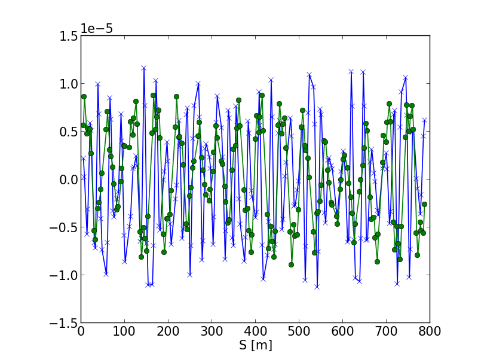
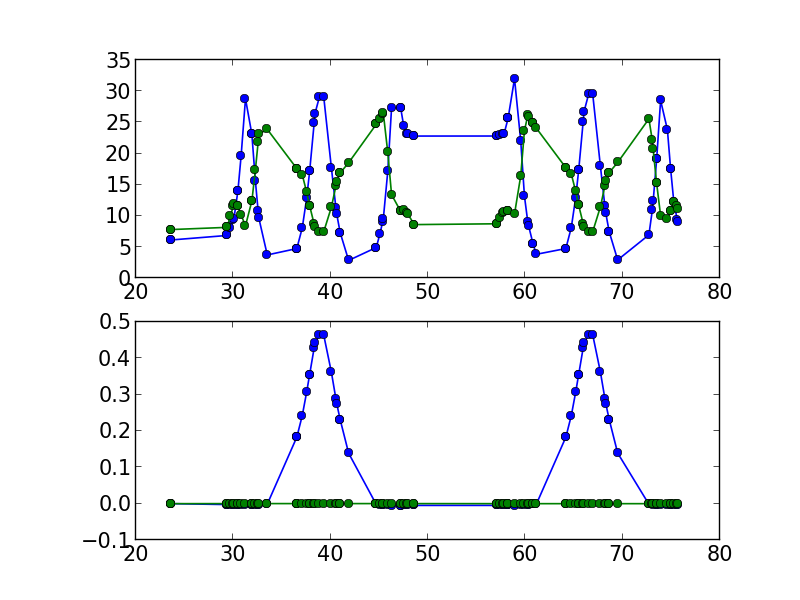
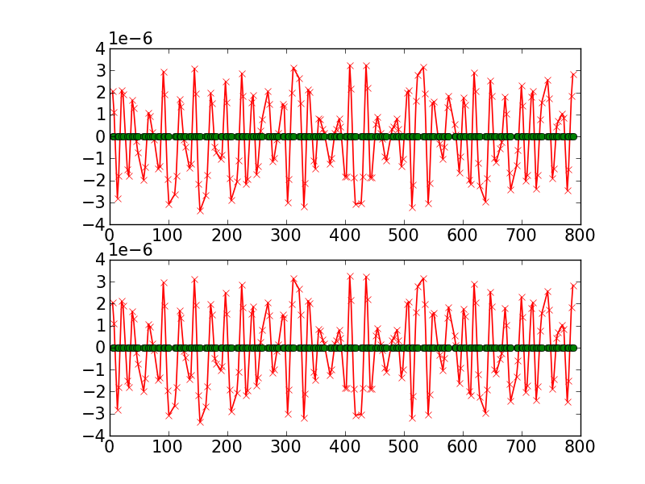

.. _tutorial:

Tutorial
=========

.. htmlonly::
   :Date: |today|

..
   The notebook style :download:`tutorial <./doc_tutorial.pdf>` is a better
   place for reading code and their output. But here explains things in more
   details.

The HLA package we are developing has three parts

- HLA Library: the element access model, lattice management and data IO.
- HLA scripts: some measurement and analysis routines.
- HLA GUI applications: ``aplauncher``, ``aporbit``, ``apbba``, ...

.. testsetup::

   from __future__ import print_function, unicode_literals

HLA Initialization
-------------------

Before using ``aphla`` we can import some python modules for data analysis
and plotting.

.. doctest::

   >>> import aphla as ap    # import aphla package
   >>> import numpy as np    # import NumPy
   >>> import matplotlib.pylab as plt    # matplotlib for plotting
   >>> import time

.. note::

   The text after '#' are comments for the rest of that line, '>>>' is a
   prompt for interactive Python environment.

Initialize the NSLS2 Virtual Storage Ring lattice and load the twiss data:

.. doctest::

   >>> ap.machines.init("nsls2v2")

:func:`~aphla.machines.init("nsls2v2")` will initialize the lattice structure of
`NSLS2 Virtual Accelerastor #2`. It is not the hardware initialization and did
not do any hardware operation inside. 

.. note::

    By default, this initialization will search search for channel finder
    server and use the data there. It can be overwritten with your own config
    file.

``aphla`` can keep several initialized lattices, depending how many
*aphla.sys.* tags in the configuration. Currently we have *aphla.sys.SR*,
*aphla.sys.LTD1*, *aphla.sys.LTD2*, *aphla.sys.LTB* for the real machine. The
`V1` prefix before `SR`, `LTD1` means it is the `virtual accelerator #1`
counter part. :func:`~aphla.machines.lattices` lists the initialized lattices
and :func:`~aphla.machines.use` will switch to the named lattice as the
current lattice. This current lattice is the domain for functions like
:func:`~aphla.hlalib.getElements`.

.. code-block:: python

   >>> ap.machines.lattices()    # list available lattices #doctest: +SKIP
   [u'V1LTD1', u'V1LTD2', u'V1LTB', u'V1SR']
   >>> ap.machines.use("V1SR")

Switching between lattices should be always a safe operation itself, but may
affect the following operations.

HLA Element Searching
---------------------

The lattice is merely a list of elements. In order to control the element,
we first get the instance from lattice by :func:`~aphla.hlalib.getElements`
providing with element name, name list, type or pattern. 

Here are some examples:

.. doctest::

   >>> bpm = ap.getElements('BPM') # get a list of BPMs
   >>> len(bpm) # 180 in tital, guaranteed in increasing order of s coordinate.
   180
   >>> bpm[0].name
   u'PH1G2C30A'
   >>> bpm[0].family, bpm[0].cell, bpm[0].girder
   (u'BPM', u'C30', u'G2')

.. index:: family, cell, girder, symmetry, group
.. index::
   single: property; family
   single: property; girder
   single: property; cell
   single: property; symmetry
   single: property; group

Each element has a set of properties associated:

- *family* (element type). e.g. 'QUAD', 'BPM'
- *cell*. The DBA cell it belongs. e.g. 'C02', 'C30'
- *girder*, girder name where it sits. e.g. 'G2', 'G1'
- *symmetry*, 'A' or 'B' symmetry
- *group*. *family*, *cell*, *girder* and *symmetry* are special named groups
  and form the default group that element belongs to. A BPM in girder 2 cell 2
  could be in group 'C02', 'G2', 'BPM' and more. e.g. 'PM1' is a resonable
  group name for bpm 'PM1G4C02B'.

An element can only belong to one *family*, *cell*, *girder* and
*symmetry*. But it can be in many groups:

.. doctest::

   >>> ap.getGroups('pm1g4c02b') # the groups one element belongs to #doctest: +SKIP
   [u'BPM', u'C02', u'G4', u'B']

To find the elements in certain cell or/and girder, use *getGroupMembers* and
take *union* or *intersection* of them.

The following lines search for all BPMs in girder 4 of cell 15.

.. doctest::

   >>> el = ap.getGroupMembers(['BPM', 'C15', 'G4'], op='intersection')
   >>> for e in el: print e.name, e.sb, e.length
   pm1g4c15a 407.882 0.0
   pm1g4c15b 410.115 0.0

Whenever the search routine, e.g. `~aphla.getElements`,
`~aphla.getGroupMembers` and `~aphla.getNeighbors`, returns a list of
elements, the result is sorted in ascending order of s-coordinate.

The following lines find all BPMs in the girder 2 of cell 2 and 3.

.. doctest::

   >>> el = ap.getGroupMembers(['BPM', 'C0[2-3]', 'G2'])
   >>> for e in el: print e.name, e.sb, e.cell, e.girder, e.symmetry
   ph1g2c02a 57.7322 C02 G2 A
   ph2g2c02a 60.2572 C02 G2 A
   pl1g2c03a 82.7858 C03 G2 A
   pl2g2c03a 85.3495 C03 G2 A

A pattern matching is also possible when searching for element or groups. The
pattern string follows Unix filename convension, see :ref:`Wildcard Matching
<element-search-match>`

.. doctest::

   >>> ap.getElements('P*C01*A') #doctest: +NORMALIZE_WHITESPACE
   [PL1G2C01A:BPM @ sb=29.988600, PL2G2C01A:BPM @ sb=32.552300, PM1G4C01A:BPM @ sb=38.301800]
   >>> ap.getGroups('P*C01*A') # a union of the groups of matched elements
   [u'BPM', u'C01', u'G4', u'G2', u'A']

HLA Element Control
---------------------

   >>> el = ap.getElements(['SQMG4C05A', 'QM2G4C05B', 'CXH2G6C05B', 'PM1G4C05A'])
   >>> for e in el: print e.status() #doctest: +ELLIPSIS
   SQMG4C05A
   QM2G4C05B
     k1: 1.222...
   CXH2G6C05B
     x: ...
   PM1G4C05A
     y: ...
     x: ...

   >>> for e in el: print e.name, e.pv('eget'), e.value #doctest: +SKIP
   SQMG4C05A [u'SR:C05-MG:G04A{SQuad:M1}Fld-I'] 0.0
   QM2G4C05B [u'SR:C05-MG:G04B{Quad:M2}Fld-I'] 1.22232651254
   CXH2G6C05B [u'SR:C05-MG:G06B{HCor:H2}Fld-I'] 0.0
   PM1G4C05A [u'SR:C05-BI:G04A{BPM:M1}SA:X-I', u'SR:C05-BI:G04A{BPM:M1}SA:Y-I'] [0.00024599597546417758, 5.0644899005954578e-05]
   
It is easy to read/write the default value of an element:

.. doctest::

   >>> e = ap.getElements('CXH2G2C30A')
   >>> print e.status #doctest: +SKIP
   CXH2G2C30A
     READBACK (SR:C30-MG:G02A{HCor:H2}Fld-I): 0.0
     SETPOINT aphla.eput (SR:C30-MG:G02A{HCor:H2}Fld-SP): 1e-07
     READBACK (SR:C30-MG:G02A{HCor:H2}Fld-I): 9.9982402533e-08
     SETPOINT (SR:C30-MG:G02A{HCor:H2}Fld-SP): 1e-07

   >>> print e.value #doctest: +SKIP
   0.0
   >>> e.value = 1e-7 #doctest: +SKIP
   >>> e.value #doctest: +SKIP
   9.998240253299763e-08

More Examples
--------------

.. doctest::

   >>> ap.getCurrent() #doctest: +SKIP
   292.1354803937125
   >>> lft = ap.getLifetime() 
   >>> print "Fitted lifetime:", lft, "Hour" #doctest: +SKIP
   Fitted lifetime: 7.2359460167254399 Hour

Plotting the orbit
 
.. doctest::
 
   >>> sobt = ap.getOrbit(spos = True)
   >>> plt.clf() #doctest: -SKIP
   >>> plt.plot(sobt[:,2], sobt[:,0], '-x', label='X') #doctest: +ELLIPSIS -SKIP
   [<matplotlib.lines.Line2D object at 0x...>]
   >>> plt.plot(sobt[:,2], sobt[:,1], '-o', label='Y') #doctest: +ELLIPSIS -SKIP
   [<matplotlib.lines.Line2D object at 0x...>]
   >>> plt.xlabel('S [m]') #doctest: +ELLIPSIS -SKIP
   <matplotlib.text.Text object at 0x...>
   >>> plt.savefig('hla_tut_orbit.png') #doctest: +SKIP

Twiss parameters

.. doctest::

   >>> beta = ap.getBeta('P*G2*C03*A') #doctest: +ELLIPSIS 
   >>> bpm = ap.getElements('P*G2*C03*A')
   >>> beta_sub1 = ap.getBeta(bpm) #doctest: +ELLIPSIS
   >>> beta_sub2 = ap.getBeta(bpm, loc='b') #doctest: +ELLIPSIS

Plotting the beta function of cell 'C02' and 'C03'

.. doctest::

   >>> elem = ap.getGroupMembers(['C01', 'C02'], op='union')
   >>> beta = ap.getBeta(elem, spos=True, clean=True)
   >>> eta = ap.getDispersion(elem, spos=True, clean=True)
   >>> plt.clf()
   >>> fig1 = plt.subplot(211)
   >>> fig=plt.plot(beta[:,-1], beta[:,:-1], '-o', label=r'$\beta_{x,y}$')
   >>> fig2 = plt.subplot(212)
   >>> fig=plt.plot(eta[:,-1], eta[:,:-1], '-o', label=r'$\eta_{x,y}$')
   >>> plt.savefig("hla_tut_twiss_c0203.png") #doctest: +SKIP

Correct the orbit and plot the orbits before/after the correction:

.. doctest::

   >>> print ap.__path__ #doctest: +SKIP
   >>> bpm = ap.getElements('P*C1[0-3]*')
   >>> trim = ap.getGroupMembers(['*', '[HV]COR'], op='intersection')
   >>> print len(bpm), len(trim) #doctest: +NORMALIZE_WHITESPACE
   24 360
   >>> v0 = ap.getOrbit('P*', spos=True)
   >>> ap.correctOrbit(bpm, trim, repeat=3) #doctest: +ELLIPSIS +NORMALIZE_WHITESPACE
   Euclidian norm: ...
   >>> time.sleep(4)
   >>> v1 = ap.getOrbit('P*', spos=True)
   >>> plt.clf()
   >>> ax = plt.subplot(211) 
   >>> fig = plt.plot(v0[:,-1], v0[:,0], 'r-x', label='X') 
   >>> fig = plt.plot(v0[:,-1], v0[:,1], 'g-o', label='Y')
   >>> ax = plt.subplot(212)
   >>> fig = plt.plot(v1[:,-1], v1[:,0], 'r-x', label='X')
   >>> fig = plt.plot(v1[:,-1], v1[:,1], 'g-o', label='Y')
   >>> plt.savefig("hla_tut_orbit_correct.png") #doctest: +SKIP

.. doctest::

   >>> ap.getChromaticity() #doctest:+SKIP

.. note::

   Necessary packages including linear algebra, frequency analysis,
   statistics, data IO, database, network, regular expression and
   visualization will be provided. See `Python <http://www.python.org>`_,
   `SciPy <http://www.scipy.org>`_, `NumPy <http://numpy.scipy.org/>`_,
   `iPython <http://ipython.scipy.org>`_, `matplotlib
   <http://matplotlib.sourceforge.net>`_.

HLA Lib Summary
---------------------

The following are some common functions. Please see :doc:`libref` for a list of
documented modules, methods and functions.

.. include:: hlasummary.txt

.. 
  /.. math::
  G(s,s_0)=\dfrac{\sqrt{\beta(s)\beta(s_0)}}{2\sin\pi\nu}\cos(\pi\nu-\left|\psi(s)-\psi(s_0)\right|)

